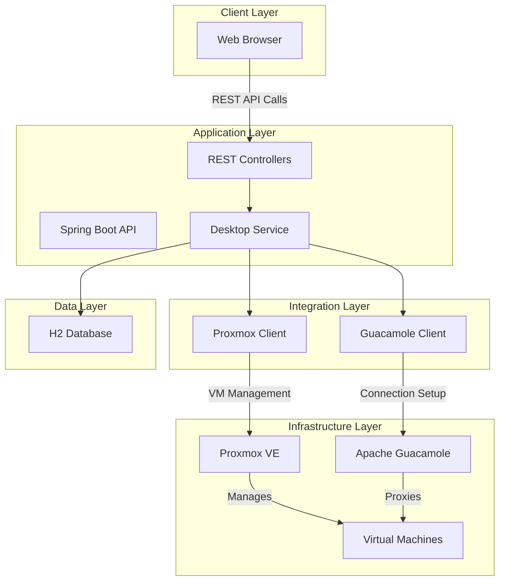
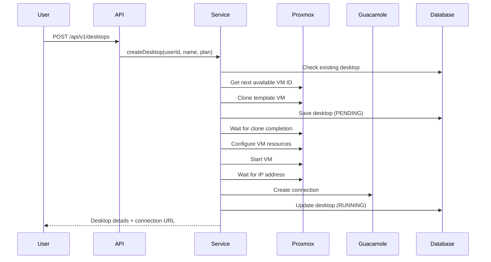
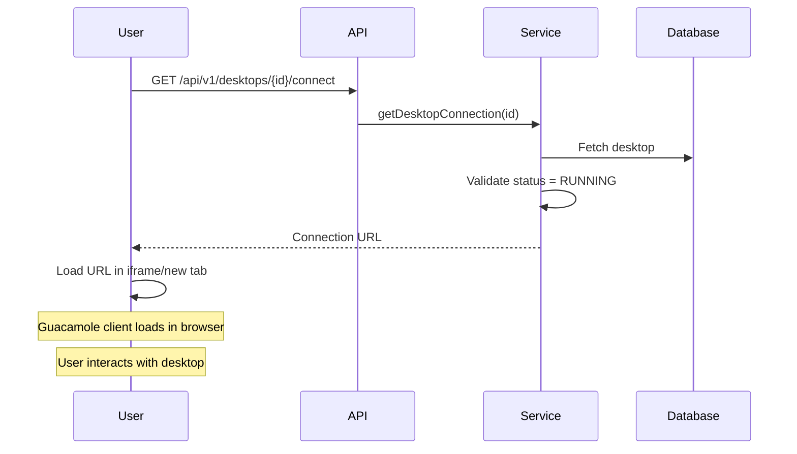
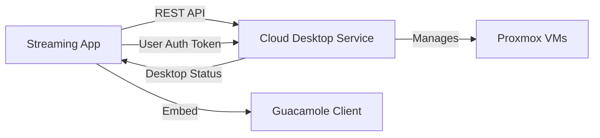
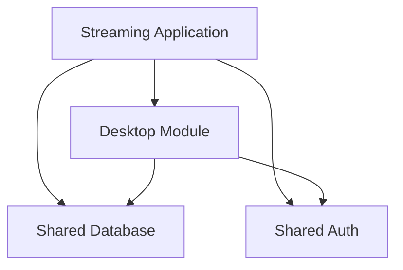

# Technical Product Requirements Document (PRD)
## Cloud Desktop as a Service - Feature Integration

**Document Version:** 1.0  
**Last Updated:** November 28, 2024  
**Status:** Proof of Concept (POC) - Ready for Review

---

## Executive Summary

This document outlines the **Cloud Desktop as a Service (DaaS)** feature - a proof of concept that enables on-demand provisioning of virtual desktop environments accessible through web browsers. The solution integrates virtualization infrastructure (Proxmox VE) with remote desktop gateway technology (Apache Guacamole) to deliver seamless, browser-based desktop experiences.

### Key Value Propositions

- **Zero Installation**: Users access full desktop environments directly through web browsers
- **On-Demand Provisioning**: Desktops are created, started, and stopped programmatically via REST APIs
- **Scalable Architecture**: Built on enterprise virtualization platform with horizontal scaling capabilities
- **Multi-Protocol Support**: Supports SPICE and VNC protocols for optimal performance
- **Resource Flexibility**: Tiered plans (Basic, Standard, Premium) for different use cases

---

## 1. Product Overview

### 1.1 What is Cloud Desktop?

Cloud Desktop is a **Desktop-as-a-Service (DaaS)** solution that provides users with fully functional virtual desktop environments accessible from any device with a web browser. Unlike traditional remote desktop solutions that require client software installation, this solution leverages browser-native technologies to deliver desktop experiences.

### 1.2 Core Capabilities

| Capability | Description |
|------------|-------------|
| **Desktop Provisioning** | Automated creation of virtual machines from templates |
| **Lifecycle Management** | Start, stop, and delete operations for desktop instances |
| **Browser Access** | Zero-install access via embedded Guacamole client |
| **Status Monitoring** | Real-time status tracking and health checks |
| **Resource Allocation** | Configurable CPU and memory based on plan tiers |
| **Connection Management** | Automated connection setup with protocol selection |

### 1.3 Target Use Cases

- **Development Environments**: Provide developers with pre-configured development desktops
- **Training & Education**: Deliver consistent lab environments for students
- **Secure Workspaces**: Isolated environments for sensitive operations
- **Testing & QA**: On-demand test environments with specific configurations
- **Remote Work**: Browser-accessible workstations for distributed teams

---

## 2. Technical Architecture

### 2.1 System Components



### 2.2 Technology Stack

| Layer | Technology | Purpose |
|-------|-----------|---------|
| **Backend Framework** | Spring Boot 3.2.0 | REST API and business logic |
| **Language** | Java 17 | Application development |
| **Database** | H2 (POC) / PostgreSQL (Production) | Desktop metadata storage |
| **Virtualization** | Proxmox VE | VM lifecycle management |
| **Remote Access** | Apache Guacamole | Browser-based desktop gateway |
| **Protocols** | SPICE, VNC | Remote desktop protocols |
| **API Client** | Apache HttpClient 5 | External service integration |

### 2.3 Data Model

The system maintains desktop metadata with the following key attributes:

- **Identity**: Desktop ID, User ID, Name
- **Infrastructure**: VM ID, IP Address, Connection ID
- **Configuration**: Plan (Basic/Standard/Premium), CPU Cores, Memory
- **State**: Status, Status Message, Error Message
- **Connectivity**: Connection URL, Protocol
- **Lifecycle**: Created At, Updated At, Last Accessed, Expires At

---

## 3. User Workflows

### 3.1 Desktop Creation Flow



**Status Progression**: `PENDING` → `PROVISIONING` → `STARTING` → `WAITING_FOR_IP` → `CONFIGURING` → `RUNNING`

### 3.2 Desktop Access Flow



### 3.3 Desktop Lifecycle Operations

| Operation | Endpoint | Status Transition | Description |
|-----------|----------|-------------------|-------------|
| **Create** | `POST /api/v1/desktops` | `null` → `RUNNING` | Provision new desktop |
| **Start** | `POST /api/v1/desktops/{id}/start` | `STOPPED` → `RUNNING` | Power on existing desktop |
| **Stop** | `POST /api/v1/desktops/{id}/stop` | `RUNNING` → `STOPPED` | Graceful shutdown |
| **Delete** | `DELETE /api/v1/desktops/{id}` | `any` → `DELETED` | Remove desktop and VM |
| **Status** | `GET /api/v1/desktops/{id}/status` | - | Check current state |

---

## 4. Integration with Streaming Applications

### 4.1 Integration Scenarios

#### Scenario A: Premium Feature Add-On

**Use Case**: Add cloud desktop capability as a premium tier feature in an existing streaming platform.

**Integration Points**:
- User authentication: Leverage existing user management system
- Billing integration: Tie desktop provisioning to subscription tiers
- UI embedding: Embed desktop interface within streaming app UI
- Session management: Track desktop usage alongside streaming metrics

**Benefits**:
- Differentiate premium subscriptions
- Increase average revenue per user (ARPU)
- Provide value-added services beyond streaming

#### Scenario B: Content Creation Workspace

**Use Case**: Provide creators with cloud-based editing environments for content production.

**Integration Points**:
- Creator dashboard: Add "Launch Workspace" button
- File synchronization: Integrate with streaming platform's storage
- Rendering pipeline: Use desktops for video processing tasks
- Collaboration: Multi-user access to shared desktop environments

**Benefits**:
- Enable content creation without local hardware requirements
- Standardize creator tools and environments
- Reduce technical support burden

#### Scenario C: Interactive Streaming Enhancement

**Use Case**: Allow viewers to interact with applications during live streams.

**Integration Points**:
- Stream overlay: Embed desktop viewer in stream interface
- Access control: Temporary desktop access for viewers
- Event triggers: Launch desktops based on stream events
- Analytics: Track viewer engagement with interactive elements

**Benefits**:
- Increase viewer engagement and retention
- Create unique interactive experiences
- Generate new monetization opportunities

### 4.2 Technical Integration Approaches

#### Approach 1: Microservice Integration



**Implementation**:
- Deploy Cloud Desktop as independent microservice
- Use API Gateway for unified access
- Share authentication via JWT tokens
- Implement webhook callbacks for status updates

**Pros**: Loose coupling, independent scaling, technology flexibility  
**Cons**: Network latency, distributed transaction complexity

#### Approach 2: Embedded Module Integration



**Implementation**:
- Package Cloud Desktop as library/module
- Share database and authentication layer
- Integrate directly into streaming app codebase
- Use shared configuration management

**Pros**: Reduced latency, simplified deployment, shared resources  
**Cons**: Tight coupling, technology lock-in, complex testing

#### Approach 3: Hybrid Integration

**Implementation**:
- Core desktop management as microservice
- Lightweight SDK for streaming app integration
- Shared authentication with SSO
- Event-driven communication via message queue

**Pros**: Balance of flexibility and integration, scalable, maintainable  
**Cons**: Increased infrastructure complexity

### 4.3 API Integration Examples

#### Creating Desktop for Streaming User

**Request**:
```http
POST /api/v1/desktops
Content-Type: application/json
Authorization: Bearer {streaming-app-token}

{
  "userId": "streamer_12345",
  "name": "Content Creation Workspace",
  "plan": "PREMIUM"
}
```

**Response**:
```json
{
  "success": true,
  "message": "Desktop creation initiated successfully.",
  "data": {
    "id": 1,
    "userId": "streamer_12345",
    "name": "Content Creation Workspace",
    "status": "PROVISIONING",
    "plan": "PREMIUM",
    "cpuCores": 8,
    "memoryMb": 8192
  }
}
```

#### Embedding Desktop in Streaming UI

**Frontend Integration**:
```html
<!-- Embedded in streaming app dashboard -->
<div class="desktop-container">
  <iframe 
    src="{connection-url-from-api}" 
    width="100%" 
    height="800px"
    allow="clipboard-read; clipboard-write">
  </iframe>
</div>
```

---

## 5. Resource Planning & Scaling

### 5.1 Desktop Plans

| Plan | vCPU | Memory | Target Use Case | Concurrent Users (per host) |
|------|------|--------|-----------------|----------------------------|
| **BASIC** | 2 | 2 GB | Light productivity, browsing | ~40-50 |
| **STANDARD** | 4 | 4 GB | Development, office apps | ~20-25 |
| **PREMIUM** | 8 | 8 GB | Content creation, heavy workloads | ~10-12 |

### 5.2 Infrastructure Sizing

**Example: Supporting 100 Concurrent Premium Desktops**

- **Compute**: 10 Proxmox hosts (32 cores, 128GB RAM each)
- **Storage**: 2TB NVMe for templates + 10TB SSD for desktop volumes
- **Network**: 10Gbps backbone, 1Gbps per host
- **Guacamole**: 2-node cluster with load balancer

### 5.3 Scaling Strategies

#### Vertical Scaling
- Increase resources on existing Proxmox nodes
- Upgrade network bandwidth
- Add storage capacity

#### Horizontal Scaling
- Add Proxmox nodes to cluster
- Deploy multiple Guacamole instances behind load balancer
- Implement database read replicas
- Use Redis for session management

---

## 6. Security & Compliance Considerations

### 6.1 Security Layers

| Layer | Security Measures |
|-------|------------------|
| **Network** | VLANs, firewall rules, VPN access |
| **Authentication** | API tokens, JWT, SSO integration |
| **Authorization** | User-desktop ownership validation |
| **Data** | Encrypted storage, secure connections (TLS) |
| **Isolation** | VM-level isolation, resource quotas |
| **Audit** | Request logging, access tracking |

### 6.2 Compliance Considerations

- **Data Residency**: Deploy infrastructure in required geographic regions
- **Access Controls**: Implement RBAC for desktop management
- **Audit Trails**: Log all desktop lifecycle events
- **Data Retention**: Configurable desktop expiration policies
- **Encryption**: At-rest and in-transit encryption

---

## 7. Operational Considerations

### 7.1 Monitoring & Observability

**Key Metrics**:
- Desktop provisioning time (target: < 2 minutes)
- API response times (target: < 500ms)
- VM resource utilization (CPU, memory, disk)
- Concurrent desktop sessions
- Connection quality metrics
- Error rates by operation type

**Monitoring Tools**:
- Spring Boot Actuator for application health
- Proxmox monitoring for infrastructure
- Guacamole session logs for connection quality
- Custom dashboards for business metrics

### 7.2 Disaster Recovery

**Backup Strategy**:
- Template VMs: Daily snapshots
- Desktop metadata: Continuous database replication
- User data: Configurable backup schedules
- Configuration: Version-controlled infrastructure as code

**Recovery Objectives**:
- RTO (Recovery Time Objective): 4 hours
- RPO (Recovery Point Objective): 1 hour

### 7.3 Cost Optimization

**Strategies**:
- Auto-stop idle desktops after configurable timeout
- Template optimization to reduce clone time
- Thin provisioning for storage efficiency
- Resource right-sizing based on usage patterns
- Scheduled scaling for predictable workloads

---

## 8. Implementation Roadmap

### Phase 1: POC Validation (Current)
- ✅ Core desktop lifecycle management
- ✅ Proxmox integration
- ✅ Guacamole integration
- ✅ Basic web UI for testing
- ✅ REST API endpoints

### Phase 2: Production Readiness
- [ ] Replace H2 with PostgreSQL
- [ ] Implement authentication & authorization
- [ ] Add comprehensive error handling
- [ ] Implement rate limiting
- [ ] Add monitoring and alerting
- [ ] Performance testing and optimization
- [ ] Security hardening

### Phase 3: Streaming App Integration
- [ ] Design integration architecture
- [ ] Develop integration SDK/library
- [ ] Implement SSO with streaming platform
- [ ] Create embedded UI components
- [ ] Develop webhook system for events
- [ ] Integration testing

### Phase 4: Advanced Features
- [ ] Desktop templates marketplace
- [ ] Snapshot and restore capabilities
- [ ] Desktop sharing and collaboration
- [ ] Usage analytics and reporting
- [ ] Auto-scaling based on demand
- [ ] Multi-region deployment

---

## 9. Success Metrics

### 9.1 Technical KPIs

| Metric | Target | Measurement |
|--------|--------|-------------|
| **Provisioning Time** | < 2 minutes | Time from API call to RUNNING status |
| **API Availability** | 99.9% | Uptime monitoring |
| **Connection Success Rate** | > 98% | Successful connections / total attempts |
| **Concurrent Users** | 1000+ | Peak concurrent desktop sessions |
| **Response Time (p95)** | < 500ms | API endpoint latency |

### 9.2 Business KPIs

| Metric | Target | Measurement |
|--------|--------|-------------|
| **Feature Adoption** | 20% of premium users | Users who create at least one desktop |
| **Session Duration** | > 30 minutes | Average time spent in desktop |
| **User Satisfaction** | > 4.0/5.0 | User feedback surveys |
| **Revenue Impact** | +15% ARPU | Revenue from desktop-enabled tiers |
| **Support Tickets** | < 5% of sessions | Desktop-related support requests |

---

## 10. Risks & Mitigation

| Risk | Impact | Probability | Mitigation Strategy |
|------|--------|-------------|---------------------|
| **Infrastructure Costs** | High | Medium | Implement auto-stop, usage-based pricing |
| **Performance Issues** | High | Medium | Load testing, capacity planning, caching |
| **Security Vulnerabilities** | Critical | Low | Security audits, penetration testing, updates |
| **Integration Complexity** | Medium | High | Phased rollout, comprehensive documentation |
| **User Adoption** | High | Medium | User education, intuitive UX, free trials |
| **Vendor Lock-in** | Medium | Medium | Abstract infrastructure layer, multi-cloud design |

---

## 11. Open Questions & Decisions Needed

### 11.1 Technical Decisions

- [ ] **Database Choice**: PostgreSQL vs MySQL vs MongoDB for production?
- [ ] **Authentication**: OAuth2, SAML, or custom JWT implementation?
- [ ] **Multi-tenancy**: Shared infrastructure vs dedicated per customer?
- [ ] **Storage Backend**: NFS, Ceph, or cloud storage for desktop volumes?

### 11.2 Product Decisions

- [ ] **Pricing Model**: Per-hour, per-month, or included in streaming subscription?
- [ ] **Resource Limits**: Max desktops per user? Max concurrent sessions?
- [ ] **Feature Scope**: Which advanced features for MVP vs future releases?
- [ ] **Target Audience**: All users, premium only, or enterprise tier?

### 11.3 Integration Decisions

- [ ] **Integration Pattern**: Microservice, embedded, or hybrid?
- [ ] **UI Approach**: Embedded iframe, new tab, or native component?
- [ ] **Data Sharing**: What user data to share between systems?
- [ ] **Billing Integration**: Unified billing or separate desktop charges?

---

## 12. Appendix

### 12.1 API Endpoint Reference

| Endpoint | Method | Description |
|----------|--------|-------------|
| `/api/v1/desktops` | POST | Create new desktop |
| `/api/v1/desktops` | GET | List desktops (with filters) |
| `/api/v1/desktops/{id}` | GET | Get desktop details |
| `/api/v1/desktops/{id}/status` | GET | Get desktop status |
| `/api/v1/desktops/{id}/connect` | GET | Get connection URL |
| `/api/v1/desktops/{id}/start` | POST | Start desktop |
| `/api/v1/desktops/{id}/stop` | POST | Stop desktop |
| `/api/v1/desktops/{id}` | DELETE | Delete desktop |
| `/api/v1/desktops/user/{userId}` | GET | Get user's desktop |

### 12.2 Status Definitions

| Status | Description | User Action |
|--------|-------------|-------------|
| `PENDING` | Desktop creation initiated | Wait |
| `PROVISIONING` | VM being cloned from template | Wait |
| `STARTING` | VM is booting up | Wait |
| `WAITING_FOR_IP` | Waiting for network configuration | Wait |
| `CONFIGURING` | Setting up Guacamole connection | Wait |
| `RUNNING` | Desktop ready for use | Connect |
| `STOPPING` | Desktop shutting down | Wait |
| `STOPPED` | Desktop powered off | Start or Delete |
| `FAILED` | Error occurred | Check logs, Delete |
| `DELETED` | Desktop removed | Create new |

### 12.3 Glossary

- **DaaS**: Desktop as a Service - cloud-based virtual desktop delivery
- **Proxmox VE**: Open-source virtualization management platform
- **Guacamole**: Clientless remote desktop gateway (browser-based)
- **SPICE**: Simple Protocol for Independent Computing Environments
- **VNC**: Virtual Network Computing - remote desktop protocol
- **Template VM**: Pre-configured virtual machine used for cloning
- **Clone**: Creating a new VM from an existing template
- **Guest Agent**: Software running inside VM for enhanced management

---

## Document Control

| Version | Date | Author | Changes |
|---------|------|--------|---------|
| 1.0 | 2024-11-28 | Technical PM | Initial PRD based on working POC |

**Review Status**: Draft - Pending Team Review  
**Next Review Date**: TBD  
**Approvers**: Engineering Lead, Product Manager, Architecture Team
