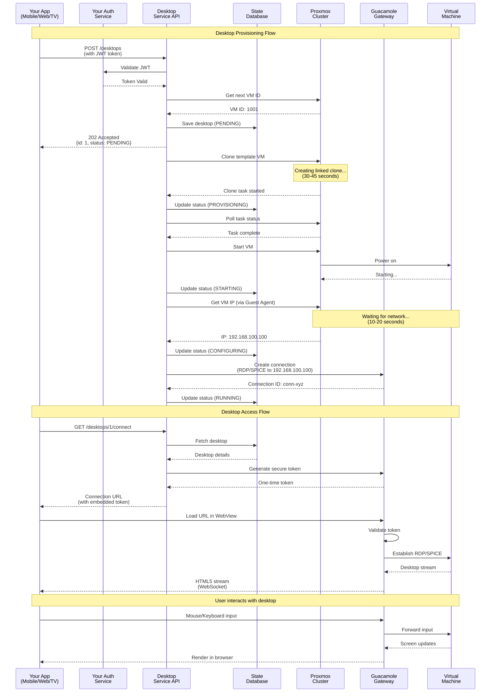

# Cloud Desktop Architecture Document

**Version:** 2.0  
**Type:** Technical Architecture  
**Scope:** System Components, Integration, and Scalability

---

## 1. System Architecture Overview

The Cloud Desktop system is designed as a modular, API-driven architecture that orchestrates the provisioning and management of virtual desktop infrastructure (VDI). It acts as a middleware layer between your client application and the underlying virtualization infrastructure.

### System Interaction Flow

The following sequence diagram shows how components interact during desktop provisioning and user access:

---

## 2. Component Deep Dive

### 2.1 Desktop Service (The Orchestrator)
**Technology:** Java 17, Spring Boot 3.2

The Desktop Service is the "brain" of the operation. It does not run virtual machines itself; it manages the lifecycle of resources across the infrastructure components.

*   **Responsibilities:**
    *   **State Management:** Tracks the status of every desktop (Provisioning, Running, Stopped) in its own database.
    *   **Orchestration:** Coordinates complex workflows. For example, "Create Desktop" involves:
        1.  Allocating a VM ID.
        2.  Instructing Proxmox to clone a template.
        3.  Waiting for the clone to finish.
        4.  Starting the VM.
        5.  Waiting for an IP address.
        6.  Registering the connection in Guacamole.
    *   **Abstraction:** Hides the complexity of the underlying hypervisor API from the client application.

### 2.2 Proxmox VE (The Infrastructure)
**Technology:** Debian-based, KVM/QEMU Hypervisor

Proxmox Virtual Environment (VE) is an enterprise-grade open-source server virtualization platform. It is the engine that actually runs the virtual desktops.

*   **What is it?**
    *   **Hypervisor:** It uses **KVM (Kernel-based Virtual Machine)** to turn the Linux kernel into a hypervisor, allowing it to run multiple isolated virtual machines with near-native performance.
    *   **Management Interface:** It provides a robust REST API (JSON over HTTPS) which our Desktop Service uses to automate every aspect of VM management.
    *   **Clustering:** Multiple Proxmox servers can be joined into a single "Datacenter" cluster. You can manage them as a single resource pool.

*   **How we use it:**
    *   **Templates:** We create a "Golden Image" VM (Windows or Linux) with all necessary software installed. We convert this to a template.
    *   **Linked Clones:** When a user requests a desktop, we use "Linked Clones". This creates a new VM almost instantly by referencing the template's disk rather than copying the whole thing. It saves massive amounts of disk space and time.
    *   **QEMU Guest Agent:** A small service installed inside the VM that allows the host (Proxmox) to exchange information with the guest (e.g., getting the VM's assigned IP address) without network scanning.

### 2.3 Apache Guacamole (The Gateway)
**Technology:** Java/Tomcat (Server), HTML5/JavaScript (Client)

Apache Guacamole is a clientless remote desktop gateway. It translates standard desktop protocols into HTML5, allowing users to access their desktops via a standard web browser.

*   **How it works:**
    1.  **Protocol Translation:** The Guacamole server (guacd) connects to the VM using **RDP** (Remote Desktop Protocol) or **SPICE** (Simple Protocol for Independent Computing Environments).
    2.  **Rendering:** It renders the display updates on the server side.
    3.  **Streaming:** It streams these updates to the browser using efficient WebSocket or HTTP tunnels.
    4.  **Input:** It captures mouse and keyboard events from the browser and sends them back to the VM.

*   **Why it's critical:**
    *   **No Client Software:** Users don't need to install VNC Viewer or RDP clients.
    *   **Network Security:** The VMs do not need to be exposed to the public internet. Only the Guacamole server needs port 443 (HTTPS) open. The connection from Guacamole to the VM happens on the private internal network.

---

## 3. Integration Architecture

### 3.1 Authentication & Security (Seamless Integration)

The goal is to use your existing application's authentication (e.g., Auth0, Cognito, Custom JWT) so users don't need a separate login for the desktop.

**The Flow:**

1.  **Token Exchange / Validation:**
    *   The Client App sends a request to `POST /api/v1/desktops` including the user's existing **JWT (JSON Web Token)** in the `Authorization` header.
    *   The Desktop Service validates this signature using your Auth Service's public key or introspection endpoint.
    *   **No new credentials are created.** The Desktop Service trusts the identity provided by the JWT.

2.  **Connection Security (The "Ticket" System):**
    *   When a user wants to connect, they request a connection URL from the Desktop Service.
    *   The Desktop Service generates a temporary, signed, one-time-use URL or token for Guacamole.
    *   The Client App loads this URL in an `<iframe>`.
    *   Guacamole validates the token and establishes the connection.
    *   **Result:** The user is logged in automatically.

### 3.2 API Integration Pattern

Your application interacts with the Cloud Desktop system purely via REST APIs.

*   **Provisioning:** Fire-and-forget. Call `POST /desktops`, receive a `202 Accepted` and a Desktop ID. Poll the status endpoint or use a webhook (future state) to know when it's `RUNNING`.
*   **Embedding:** Once `RUNNING`, call `GET /desktops/{id}/connect` to get the secure URL. Embed this URL in your frontend application.

---

## 4. Scalability Strategy

The architecture is designed to scale horizontally at every layer.

### 4.1 Scaling Compute (Proxmox)
*   **Clustering:** You can start with 1 Proxmox node. As user demand grows, you simply add more physical servers to the Proxmox Cluster.
*   **Resource Scheduling:** Proxmox can automatically balance VMs across nodes.
*   **Shared Storage:** By using shared storage (like Ceph, NFS, or iSCSI/SAN), VMs can run on any node. If a node fails, VMs can be restarted on another node (High Availability).

### 4.2 Scaling Access (Guacamole)
*   **Stateless Gateway:** The Guacamole web application is stateless. You can run multiple instances behind a standard Load Balancer (like NGINX or AWS ALB).
*   **Connection Balancing:** The `guacd` proxy process can also be clustered to handle thousands of concurrent active connections.

### 4.3 Scaling the Service
*   **Stateless Microservice:** The Spring Boot Desktop Service is stateless. You can run multiple replicas in Kubernetes or behind a load balancer.
*   **Database:** The state is stored in a relational database (PostgreSQL recommended for production), which can be scaled using read replicas or managed database services (RDS).

---

## 5. Network Flow

1.  **User Traffic (HTTPS):** User's browser -> Load Balancer -> Guacamole Server (Port 443).
2.  **Control Traffic (Internal):** Desktop Service -> Proxmox API (Port 8006).
3.  **Desktop Traffic (Internal):** Guacamole Server -> VM (Port 3389 for RDP or 5900+ for SPICE).

**Security Note:** The Virtual Machines live on an isolated VLAN. They do not need inbound internet access. Users *never* connect directly to the VM IP; they always go through the Guacamole gateway.
